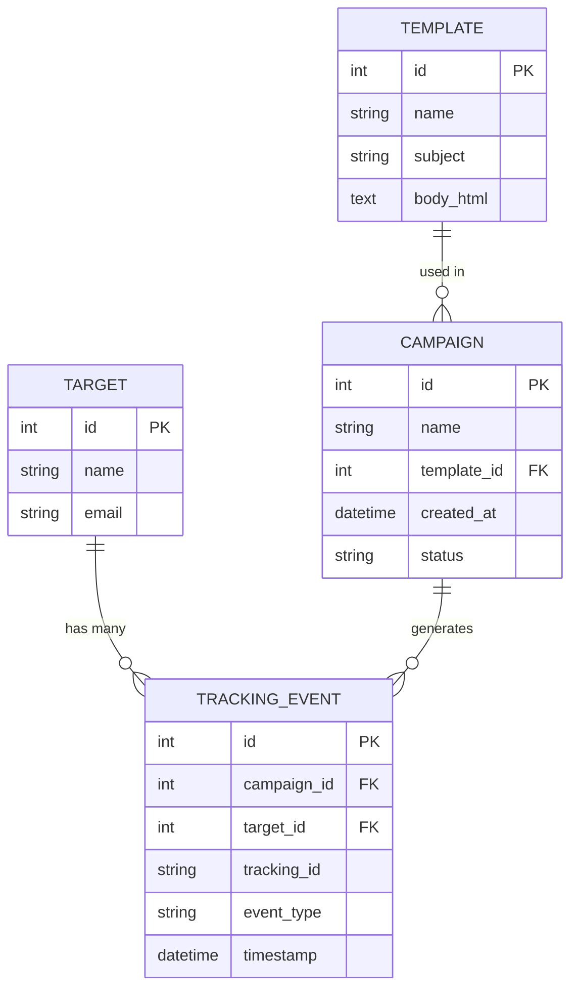

# Fishin' Generator


Fishin' Generator is a phishing email simulator that can be used for security awareness training. It will generate phishing emails, send them to targets (employees), and track engagement (opens and clicks) using a Python backend and SQLite database.

## Tech Stack

- **Backend**: Flask (Python)
- **Database**: SQLite with Flask-SQLAlchemy
- **Frontend**: HTML + Jinja2 Templates, styled with Tailwind CSS (via CDN)

## How to Run

1. Ensure you have [uv](https://docs.astral.sh/uv/) installed.
2. Install the dependencies:
   ```bash
   uv sync
   ```
3. Run the Flask application:
   ```bash
   uv run app.py
   ```
4. Open your browser and navigate to `http://localhost:5000`

## Database Schema

### Entity-Relationship Diagram



### Table Definitions

#### Target
| Column | Type | Constraints |
|---|---|---|
| id | Integer | Primary Key |
| name | String(100) | Not Null |
| email | String(120) | Unique, Not Null |

#### Template
| Column | Type | Constraints |
|---|---|---|
| id | Integer | Primary Key |
| name | String(100) | Not Null |
| subject | String(200) | Not Null |
| body_html | Text | Not Null |

#### Campaign
| Column | Type | Constraints |
|---|---|---|
| id | Integer | Primary Key |
| name | String(100) | Not Null |
| template_id | Integer | Foreign Key |
| created_at | DateTime | Not Null |
| status | String(20) | Not Null |

#### TrackingEvent
| Column | Type | Constraints |
|---|---|---|
| id | Integer | Primary Key |
| campaign_id | Integer | Foreign Key |
| target_id | Integer | Foreign Key |
| tracking_id | String(36) | Indexed |
| event_type | String(20) | Not Null |
| timestamp | DateTime | Not Null |
