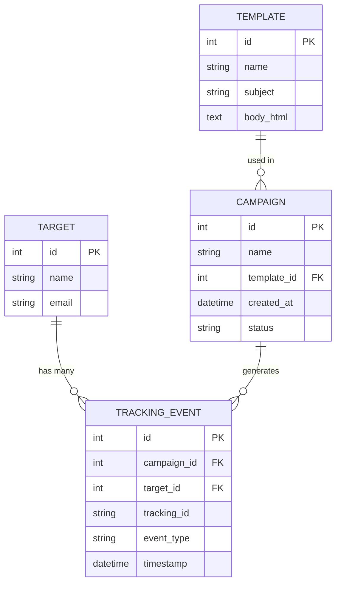

# Fishin' Generator 🎣


Fishin' Generator is a realistic phishing email simulator designed for corporate security awareness training. It allows security teams to generate and send safe, simulated phishing emails to employees, and tracks engagement (opens and clicks) to identify vulnerabilities in the human firewall.

Instead of just a technical exercise, this is positioned as a **business solution**. It demonstrates a deep understanding of social engineering—the number one attack vector for modern breaches—and provides actionable metrics for training.

---

## 🛠️ Tech Stack & Architecture

- **Backend**: Flask (Python) - Lightweight and perfect for serving the dashboard UI and handling fast API tracking endpoints.
- **Database**: SQLite with Flask-SQLAlchemy (SQLAlchemy 2.0 API) - A robust, file-based relational database to store targets, templates, and tracking events.
- **Frontend**: HTML + Jinja2 Templates, powered by **HTMX** for dynamic real-time updates without page reloads, and styled with Tailwind CSS (via CDN) for a clean, modern, and professional aesthetic.
- **Email Delivery**: Standard Python `smtplib` + `email.mime` for generating and dispatching HTML emails, with a built-in "Dry Run" mode for safe local testing.

---

## ✨ Core Features

### 1. Modern Dashboard
The simulator features a responsive, professional dashboard built with Tailwind CSS. Security teams can view high-level metrics (Total Campaigns, Total Targets) and see the real-time status of their tests.

### 2. Pre-Loaded Social Engineering Templates
The database comes seeded with 12 foundational phishing templates designed to mimic real-world attacks. These templates exploit specific emotional triggers:
- **Urgency/Fear**: e.g., "Credential Reset Notification" or "MFA Fatigue Bypass".
- **Authority**: e.g., "Executive Wire Transfer Request".
- **Curiosity/Familiarity**: e.g., "HR Policy Document" or "Fake File Share".

### 3. Safe Educational Landing Page
If an employee falls for the simulation and clicks a malicious link, they are safely redirected to a local `phished.html` landing page. This page breaks the news gently and provides immediate, constructive feedback on how they could have spotted the phishing attempt (e.g., checking the sender domain, hovering over links).

---

## 🔍 Deep Dive: The Tracking Mechanism

The core logic of the project relies on tying specific actions back to a single user through a unique identifier. Here is exactly how the lifecycle of an event is tracked:

### Phase 1: The "Sent" Event
When a campaign is launched, the Flask backend (`app.py`) iterates through the selected targets.
1. It generates a unique UUID (`tracking_id`) for that specific target.
2. It inserts a row into the `TrackingEvent` database table with `event_type='Sent'`.
3. It passes this `tracking_id` to the `mailer.py` script.

### Phase 2: The "Opened" Event (Pixel Tracking)
To know if a user opened the email, we use a **tracking pixel**:
1. `mailer.py` appends an invisible HTML `` tag to the bottom of the email: 
   `.gif" width="1" height="1" style="display:none;" />`
2. When the employee's email client renders the HTML, it automatically makes an HTTP `GET` request to our server to download that image.
3. Our server catches that request, looks up the `tracking_id`, logs an `'Opened'` event in the database, and returns a transparent 1x1 pixel so the user sees nothing broken.

### Phase 3: The "Clicked" Event (Link Rewriting)
To track if a user falls for the trap, we dynamically rewrite the links in the email:
1. The templates use a placeholder `{{ tracking_url }}` for their call-to-action buttons.
2. During email generation, Jinja replaces this with a custom URL: `http://our-server/track/click/<tracking_id>`.
3. When the user clicks the "Reset Password" button, their browser navigates to our server.
4. Our server catches the request, logs a `'Clicked'` event using the `tracking_id`, and redirects the user to the educational training page.

*(Note: The `tracking_id` column in the database is **Indexed**, rather than Unique, allowing us to store multiple events—Sent, Opened, Clicked—under the same ID for fast querying).*

---

## 🚀 How to Run

1. Ensure you have [uv](https://docs.astral.sh/uv/) installed.
2. Install the dependencies:
   ```bash
   uv sync
   ```
3. Run the Flask application:
   ```bash
   uv run app.py
   ```
4. Open your browser and navigate to `http://localhost:5000`.

> [!TIP]
> **Dry Run Mode:** By default, if no SMTP credentials are provided via a `.env` file, the simulator will automatically run in "Dry Run" mode. Instead of actually sending emails, it will save the generated HTML email into a `dry_run_emails/` folder and print the raw HTML to the terminal. You can simply double-click the saved `.html` file to view the email in your browser and test the clicking flow safely!

---

## 🗄️ Database Schema

### Entity-Relationship Diagram



### Table Definitions

#### Target
| Column | Type | Constraints |
|---|---|---|
| id | Integer | Primary Key |
| name | String(100) | Not Null |
| email | String(120) | Unique, Not Null |

#### Template
| Column | Type | Constraints |
|---|---|---|
| id | Integer | Primary Key |
| name | String(100) | Not Null |
| subject | String(200) | Not Null |
| body_html | Text | Not Null |

#### Campaign
| Column | Type | Constraints |
|---|---|---|
| id | Integer | Primary Key |
| name | String(100) | Not Null |
| template_id | Integer | Foreign Key |
| created_at | DateTime | Not Null |
| status | String(20) | Not Null |

#### TrackingEvent
| Column | Type | Constraints |
|---|---|---|
| id | Integer | Primary Key |
| campaign_id | Integer | Foreign Key |
| target_id | Integer | Foreign Key |
| tracking_id | String(36) | Indexed |
| event_type | String(20) | Not Null |
| timestamp | DateTime | Not Null |

---

## 🐛 Bugs and Known Issues

### Brittle Open Tracking in Full HTML Templates
- **Issue**: Previously, the tracking pixel was simply appended to the end of the email's HTML content. While this worked for simple snippets, it resulted in invalid HTML for full documents (placing the `` tag after the `</html>` closing tag), which could cause tracking to fail in strict email clients. Additionally, authors could not manually place the pixel within their templates.
- **Solution**: The tracking mechanism now uses "Smart Insertion." It searches for a `</body>` tag and inserts the pixel immediately before it. If no body tag is found, it safely falls back to appending. Furthermore, the `{{ tracking_pixel_url }}` variable is now exposed to the Jinja context, allowing for manual placement, while built-in logic prevents duplicate pixels from being added.
